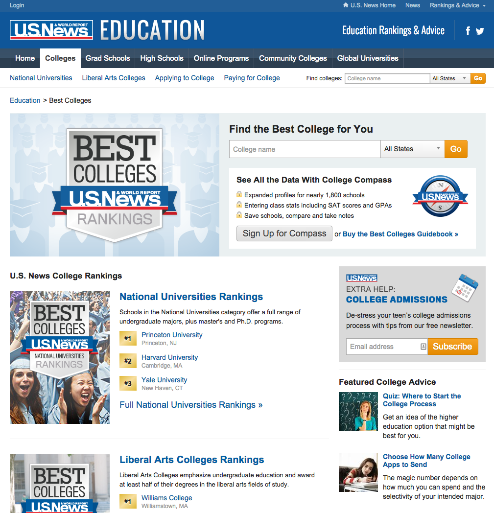
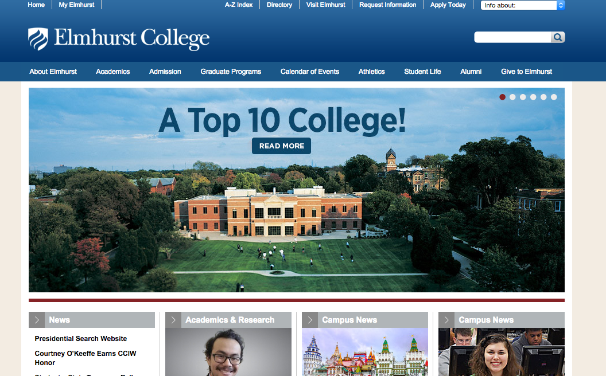
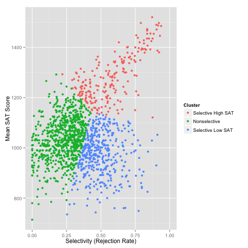
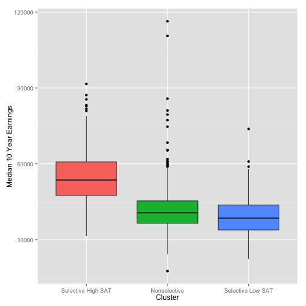
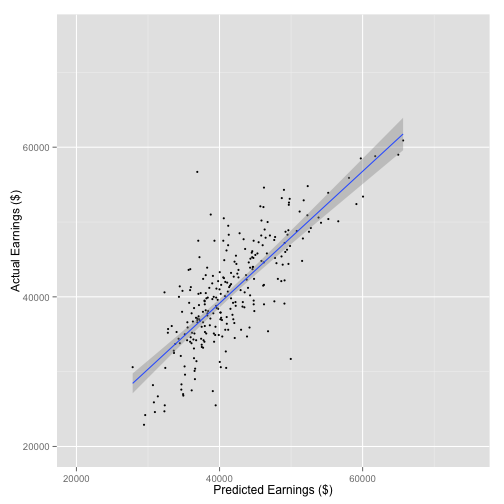
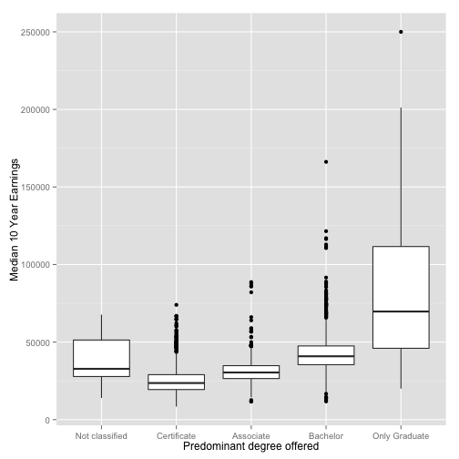

Analysis of the 2011 College Scorecard Data Set
========================================================
author: Keith Hultman
date: October 24, 2015

College and university background
========================================================

* Currently 20 million college students in US
* Expected to increase to 23 million by 2020
* 25% of HS students apply to 7 or more colleges

US News Best Colleges Rankings
========================================================

* Famous ranking of schools
* Considers quantitative measures of academic quality
* Each metric is weighted - determined by expertise
* Broken down by Carnegie classification

***

========================================================

College Scorecard
========================================================
U.S. Department of Education
* Released September 2015
* Unbiased assessment of College metrics
* Includes earnings after attending
* Completely new resource for prospective students

What characteristics of colleges can predict future earnings?
========================================================

Three different groups of schools based on incoming students
========================================================

 

Smart selective schools have high earnings
========================================================
 

What might predict future earnings?
========================================================

* Average SAT Score
* Faculty Salary
* Predominant Degree Awarded
* Highest Degree Awarded
* Cost of Tuition
* Total expenditures per student
* Admission Rate

SAT, cost of tuition, and faculty salary predicts future student earnings
========================================================
 

College perspective
========================================================
Admissions
* It's not about being selective 
* Attract high SAT students

Financial 
* Increase faculty salaries
* Increase tuition

Student perspective
========================================================
Just because schools with higher average SAT have higher earnings does not mean that this is predictive at the individual level. 

There are a lot of factors to consider, different earnings of various schools may reflect the incoming student body more than it reflects the school. 

Earnings by degree
========================================================

 

